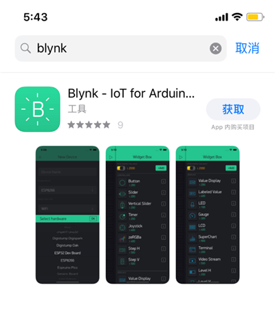
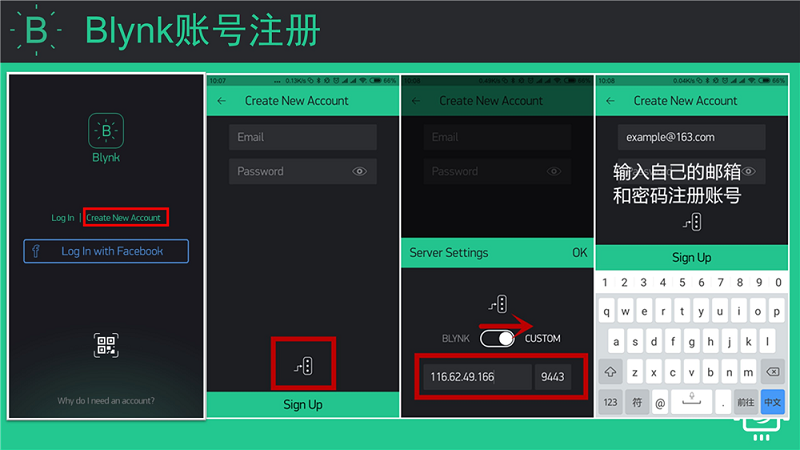
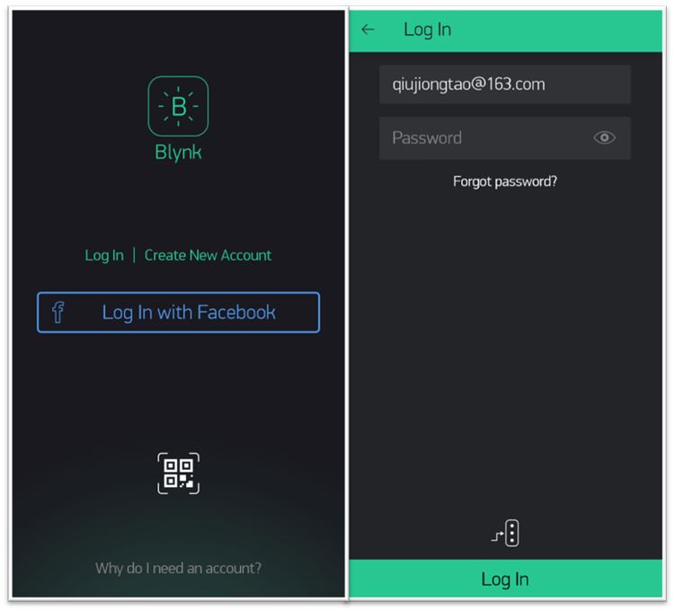
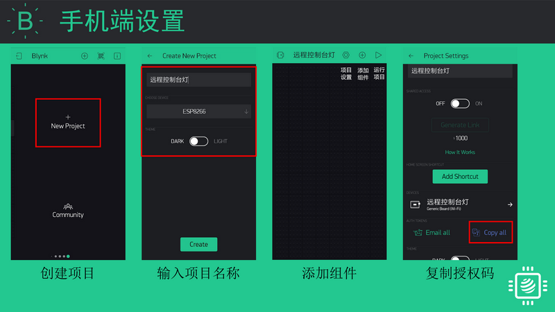

准备工作
===================

Blynk App 下载
-----------------------
安卓用户扫描下方二维码下载Blynk App。

.. Attention::
	请不要使用微信扫描该二维码，微信会屏蔽该二维码。可以使用手机浏览器自带的二维码扫描功能。

苹果用户直接在app store 中搜索blynk并下载。

Blynk账号注册
-----------------
安装好APP之后，进入app首页，点击Create New Account,输入邮箱和密码。

如果要注册国内服务器或者本地服务器的账号，在下方设置中将服务器地址改成本地服务器地址。

Blynk账号登录
-----------------

注册好账号之后，就可以登录Blynk App了。

新建Blynk项目
-------------------
* 注册完Blynk账号之后，登入App，点击New Project创建新项目。
* 设置项目名称，选择硬件类型，默认为ESP8266。
* 点击右上角 项目设置 按钮，进入项目设置界面。
* 找到Auth Token，点击Copy All复制授权码（IOS版本直接点击授权码进行复制）。

