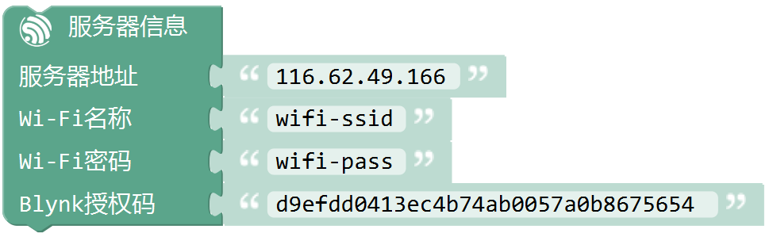
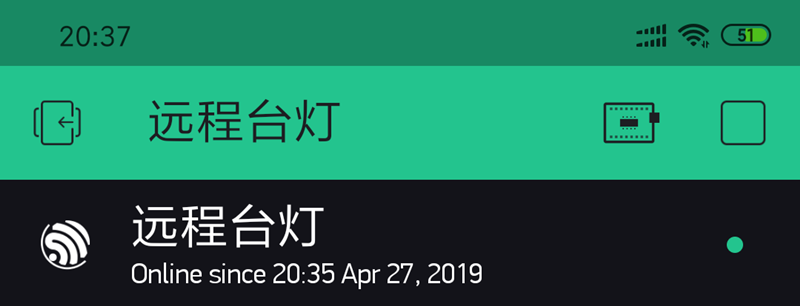
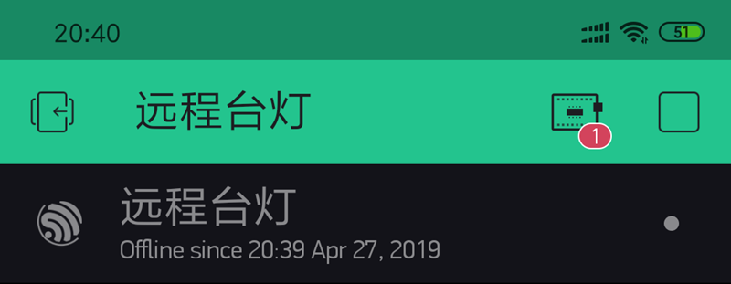
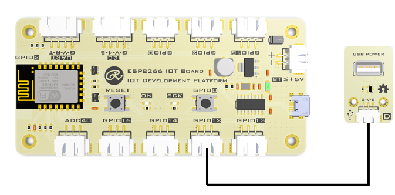
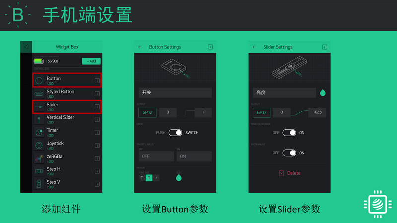
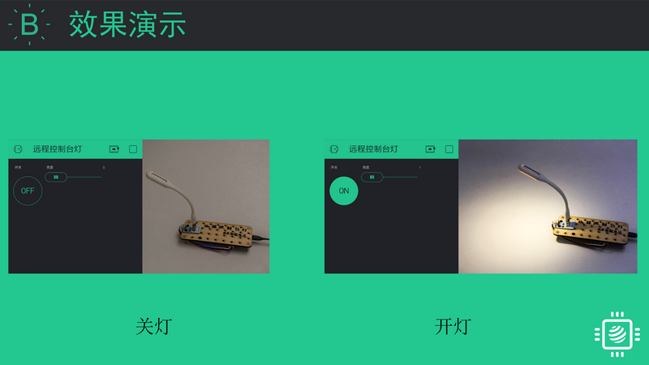
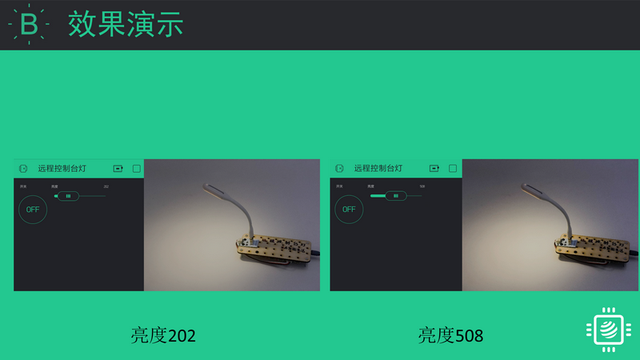
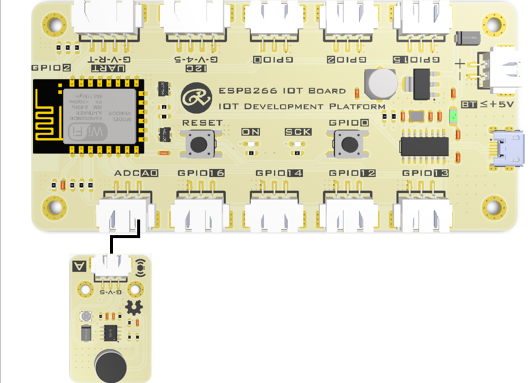
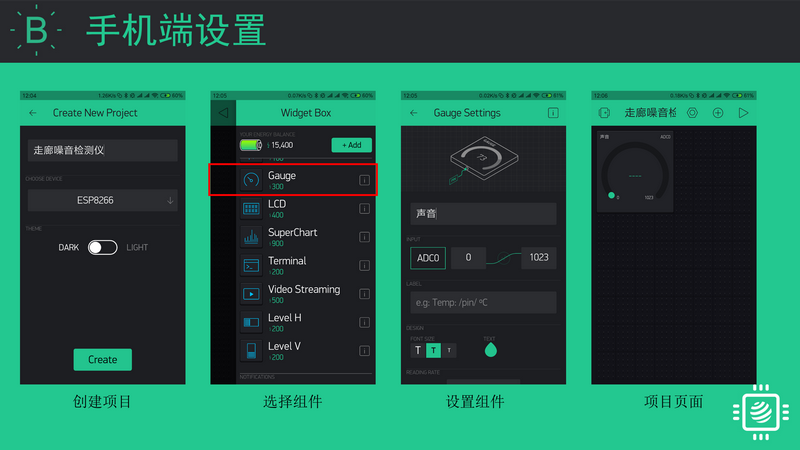

设置服务器信息
==================

.. code-block:: c
	:linenos:

	#define BLYNK_PRINT Serial
	#include <BlynkSimpleEsp8266.h>
	#include <ESP8266WiFi.h>
	#include <TimeLib.h>
	#include <WidgetRTC.h>
	char auth[] = "d9efdd0413ec4b74ab0057a0b8675654";
	char pass[] = "wifi-pass";
	char ssid[] = "wifi-ssid";
	void setup(){
	  Serial.begin(9600);
	  Blynk.begin(auth, ssid, pass,IPAddress(116,62,49,166),8080);
	}
	void loop(){
	  Blynk.run();
	}

描述
---------------

.. note::
	用于配置ESP8266 开发板连接Blynk服务器。

	当开发板与Blynk服务器连接成功后，开发板与App之间就可以建立通信。App端可以直接读取开发板的数字信号、模拟信号数据，也可以直接控制开发板的数字引脚电平高低或者PWM输出。即，可以实现简单控制。

.. Attention::

	* 在ESP32/ESP8266板卡中：服务器地址使用IP时，间隔符为英文逗号(,)。
	* 在Arduino板卡中：服务器地址使用IP时，间隔符为英文句号(.)。

参数
------------------

* 服务器地址：
	* Blynk官方地址:blynk-cloud.com;
	* Blynk国内服务器地址：116.62.49.166;
	* 也可以使用您自己的本地服务器
* Wi-Fi名称:开发板需要连接的Wi-Fi名称。
* Wi-Fi密码:开发板需要连接的Wi-Fi的密码。
* Blynk授权码：通过Blynk App内创建项目而产生的唯一授权码, `产生授权码 <01.Prepare.html#id3>`_。

效果
-------------
程序正常上传后，在App端可以看到设备已上线的标志。

点击App右上角的三角箭头启动项目。

如果程序上传失败或者程序中存在错误，就会导致没有开发板连接到该项目。

范例1:App控制数字输出
------------------------

当开发板与服务器连接成功后，App与该开发板之间的通讯就建立完成。
可以在App中创建组件，控制开发板上的引脚。

硬件连接
+++++++++++++++
在GPIO12引脚连接一个USB电源模块，在USB电源模块上再插USB台灯/风扇。

或者在GPIO12引脚连接其他元件，如LED灯。

App设置
+++++++++++++++++
在APP端添加Button组件，用于控制GPIO12引脚的开关。

在APP端添加Slider组件，用于控制GPIO12引脚的PWM输出值。

效果
++++++++++++++

范例2:App查看引脚值
------------------------

当开发板与服务器连接成功后，App与该开发板之间的通讯就建立完成。
可以在App中创建组件，查看开发板上引脚的数值。

硬件连接
+++++++++++++++
在ADCA0引脚连接一个声音传感器，或者模拟传感器，如土壤湿度传感器、光线传感器。

App设置
+++++++++++++++++
在APP端添加Guage组件，用于读取ADCA0引脚的声音值。

效果
++++++++++++++
当声音传感器检测到声音值变大时，App端的Guage组件显示的数值就变大。