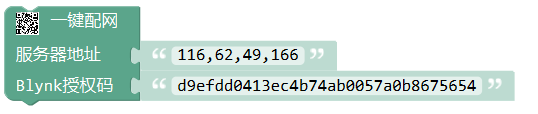
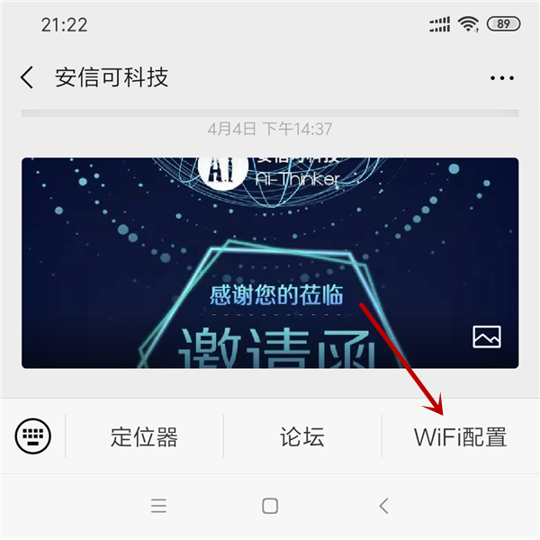
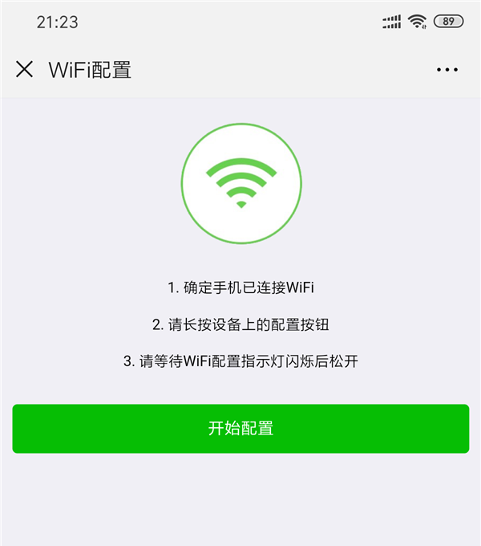

一键配网
=================

.. code-block:: c
	:linenos:

	#define BLYNK_PRINT Serial
	#include <BlynkSimpleEsp8266.h>
	#include <ESP8266WiFi.h>
	#include <TimeLib.h>
	#include <WidgetRTC.h>
	char auth[] = "d9efdd0413ec4b74ab0057a0b8675654";
	void setup(){
	  Serial.begin(9600);
	  WiFi.mode(WIFI_STA);
	  int cnt = 0;
	  while (WiFi.status() != WL_CONNECTED) {
	    delay(500);
	    Serial.print(".");
	    if (cnt++ >= 10) {
	      WiFi.beginSmartConfig();
	      while (1) {
	        delay(1000);
	        if (WiFi.smartConfigDone()) {
	          Serial.println();
	          Serial.println("SmartConfig: Success");
	          break;
	        }
	        Serial.print("|");
	      }
	    }
	  }WiFi.printDiag(Serial);
	  Blynk.config(auth,IPAddress(116,62,49,166),8080);
	}
	void loop(){
	  Blynk.run();
	}

描述
-----------------------

.. note::
	在编写程序时不确定wifi信息，等到程序上传之后，再通过手机App或微信公众号给开发板配网。
	
	方便在上传完程序后，依然可以更改wifi信息。

.. Attention::
	* 在ESP32/ESP8266板卡中：服务器地址使用IP时，间隔符为英文逗号(,)。
	* 在Arduino板卡中：服务器地址使用IP时，间隔符为英文句号(.)。

参数
-----------------------

* 服务器地址：
	* Blynk官方地址:blynk-cloud.com;
	* Blynk国内服务器地址：116,62,49,166;
	* 也可以使用您自己的本地服务器
* Blynk授权码：通过Blynk App内创建项目而产生的唯一授权码, `产生授权码 <01.Prepare.html#id3>`_。

配网方式
------------------

关注安信可微信公众号

点击右下角的wifi配置

点击 开始配置，稍等片刻即可配置完成。

