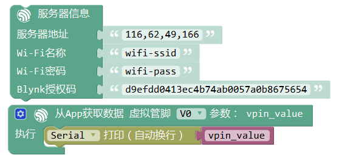

从App获取数据
================

.. code-block:: c
	:linenos:

	#define BLYNK_PRINT Serial
	#include <BlynkSimpleEsp8266.h>
	#include <ESP8266WiFi.h>
	#include <TimeLib.h>
	#include <WidgetRTC.h>
	char auth[] = "d9efdd0413ec4b74ab0057a0b8675654";
	int vpin_value;
	char pass[] = "wifi-pass";
	char ssid[] = "wifi-ssid";
	BLYNK_WRITE(V0) {
	  vpin_value= param.asInt();
	  Serial.println(vpin_value);
	}
	void setup(){
	  Serial.begin(9600);
	  Blynk.begin(auth, ssid, pass,IPAddress(116,62,49,166),8080);
	  Serial.begin(9600);
	}
	void loop(){
	  Blynk.run();
	}

描述
-------------

.. note::
	本模块用于从APP获取虚拟管脚的数值。因此必须在App端设置向该虚拟管脚发送数据。

	可以接收的数据类型包括但不限于 整数，浮点数，字符，字符串。

参数
-----------

* 传入参数：点开齿轮设置传入参数的变量类型和变量名称。**该处变量为全局变量**
* 虚拟管脚：用于接收数据的虚拟管脚，需要与App端对应。

范例1：
-------------
