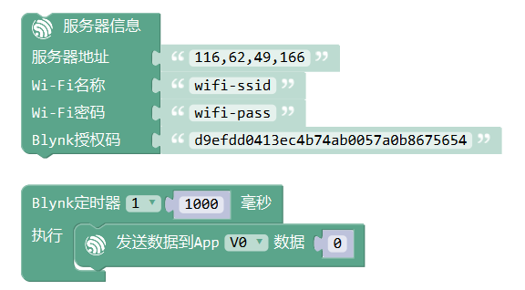
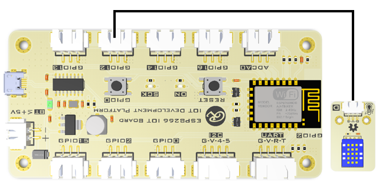
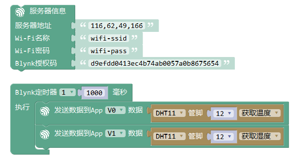

发送数据到App
================

开发板发送数据到App的虚拟管脚。

.. code-block:: c
	:linenos:

	#define BLYNK_PRINT Serial
	#include <BlynkSimpleEsp8266.h>
	#include <ESP8266WiFi.h>
	#include <TimeLib.h>
	#include <WidgetRTC.h>
	BlynkTimer timer;
	char auth[] = "d9efdd0413ec4b74ab0057a0b8675654";
	char pass[] = "wifi-pass";
	char ssid[] = "wifi-ssid";
	void myTimerEvent1() {
	  Blynk.virtualWrite(V0,0 );
	}
	void setup(){
	  Serial.begin(9600);
	  Blynk.begin(auth, ssid, pass,IPAddress(116,62,49,166),8080);
	  timer.setInterval(1000L, myTimerEvent1);
	}
	void loop(){
	  Blynk.run();
	  timer.run();
	}

描述
--------
本模块用于开发板向App发送数据。因此必须在App端设置相应组件用于接收数据。
可以发送的数据类型包括但不限于 整数，浮点数，字符，字符串。

参数
-------------

* 发送数据：需要发送的数据，支持常量和变量。
* 虚拟管脚：用于发送数据的虚拟管脚，需要与App端对应。

范例1：网络气象站
---------------------

开发板将DHT11温湿度传感器检测到的数据发送到App端V0,V1管脚。

硬件连接
+++++++++++

编写程序
+++++++++++++++++

.. code-block:: c
	:linenos:

	#define BLYNK_PRINT Serial
	#include <BlynkSimpleEsp8266.h>
	#include <DHT.h>
	#include <ESP8266WiFi.h>
	#include <TimeLib.h>
	#include <WidgetRTC.h>
	BlynkTimer timer;
	char auth[] = "d9efdd0413ec4b74ab0057a0b8675654";
	DHT dht12(12, 11);
	char pass[] = "wifi-pass";
	char ssid[] = "wifi-ssid";
	void myTimerEvent1() {
	  Blynk.virtualWrite(V0,dht12.readTemperature() );
	  Blynk.virtualWrite(V1,dht12.readHumidity() );
	}
	void setup(){
	  Serial.begin(9600);
	  Blynk.begin(auth, ssid, pass,IPAddress(116,62,49,166),8080);
	  dht12.begin();
	  timer.setInterval(1000L, myTimerEvent1);
	}
	void loop(){
	  Blynk.run();
	  timer.run();
	}

效果
++++++++++++++

