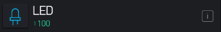
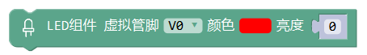

LED组件
=========

.. code-block:: c
	:linenos:

	WidgetLED ledV0(V0);
	void setup(){
	}
	void loop(){
	  ledV0.setColor("#ff0000");
	  ledV0.on();
	}

App端 LED组件

描述
------

设置App端LED组件的颜色和开关状态。

参数
-------------

* 虚拟管脚：App端LED组件的虚拟管脚值。
* 颜色选择：选择LED组件的颜色。
* 开关值：高为开，低为关。

范例
-------

LED组件颜色及亮度设置
======================

.. code-block:: c
	:linenos:

	WidgetLED ledV0(V0);
	void setup(){
	}
	void loop(){
	  ledV0.setColor("#ff0000");
	  ledV0.setValue(0);
	}

描述
-----

设置手机端LED组件的颜色和亮度。

参数
------

* 虚拟管脚：App端LED组件的虚拟管脚值。
* 颜色选择：选择LED组件的颜色。
* 亮度值：设置LED组件亮度，最暗为0，最亮100。

范例
-------

