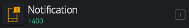

通知组件
===========

.. code-block:: c
	:linenos:

	Blynk.notify("通知内容");

App端 Notify组件

描述
-----------

.. note::
	发送通知到手机，可以用于提示传感器检测到数据或者报警情况。

.. Attention::
	* 该功能在安卓手机上需要有google Play的支持，因此国内的安卓手机无法使用该功能。

	* IOS手机需要连接官方服务器才能正常使用，本地服务器无法使用该功能。

参数
----------

* 通知内容：设置通知内容，可以加入变量值。

范例
-----