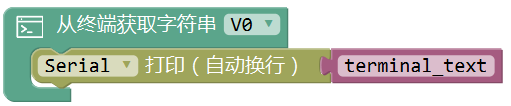
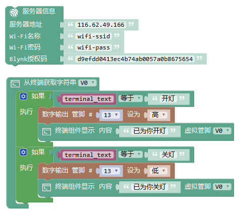
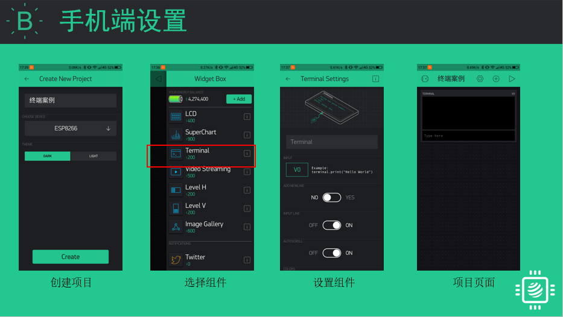

终端组件
===========

.. code-block:: c
	:linenos:

	Blynk.notify("通知内容");

App端 Terminal组件

描述
-----------

.. note::

	本模块用于从APP获取虚拟管脚的数值。因此必须在应用端设置向该虚拟管脚发送数据。
	可以接收的数据类型与从应用程序获取数据块不太一致仅为字符串类型，并且可以向APP终端写入数据可实现双向交互。

.. Attention::

	可以通过清屏指令terminal.clear()清除终端显示的内容，详情见官方文档http://docs.blynk.cc/

参数
----------

* 传入参数：仅为字符串类型数据变量，该处变量为全局变量。
* 虚拟管脚：用于接收数据的虚拟管脚，需要与App端对应。
* 输出数据：可输入任意数据，APP端终端组件将其作为字符串换行打印并显示。

范例1:远程开关灯
----------------------

在App端输入“开灯”，打开灯；在App端输入“关灯”，关闭灯。

程序：
+++++++++

App设置
+++++++++

