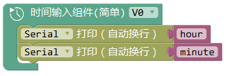

时间输入组件
===============

.. code-block:: c
	:linenos:

	BLYNK_WRITE(V0){
	long startTimeInSecs = param[0].asLong();
	int hour =startTimeInSecs/3600;
	int minute=(startTimeInSecs-3600*hour)/60;
	Serial.println(hour);
	Serial.println(minute);
	}

App端 Terminal组件

.. image:: images/16/widget_terminal.png

描述
-----------

.. note::
	获取到App端通过时间输入组件 输入的时间值。

返回值
----------

* hour：App端输入的小时值。
* minute：App端输入的分钟值。

范例
-----