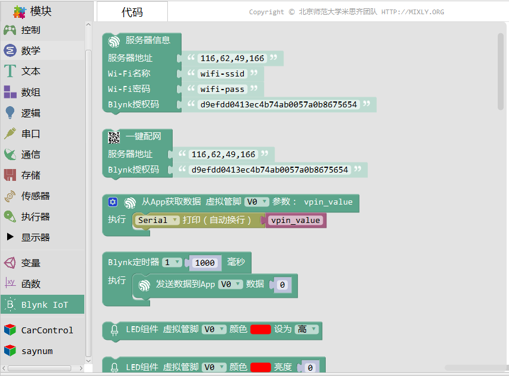

Bylnk物联网
=============

Blynk IOT类别中包含了用所有跟Blynk物联网平台相关的命令。如网络连接，发送数据，接受数据，控制组件等。

.. toctree::
   :maxdepth: 1

   01.Prepare.rst
   02.Server_info.rst
   03.Smartconfig.rst
   04.Get_data.rst
   05.Send_data.rst
   06.Widget_LED.rst
   07.Widget_Email.rst
   30.Blynk_FAQ.rst

