控制
=================

控制类别中包括了时间延迟、条件执行、循环执行、获取运行时间、初始化、Switch执行等
控制模块中主要执行的内容是对程序结构进行的相应控制。

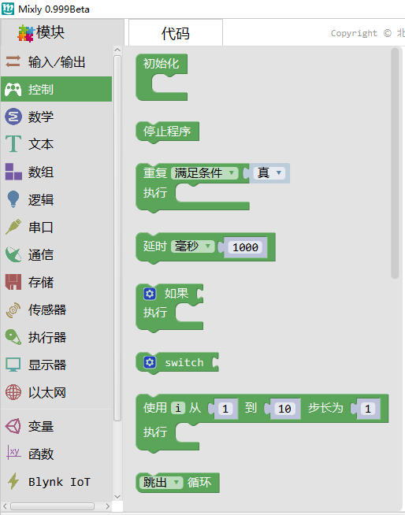

初始化
-----------------------

.. image:: images/03/setup.png

描述
++++++++++++++

.. note::
	在Arduino中程序运行时将首先调用 setup()函数。
	用于初始化变量、设置针脚的输出\输入类型、配置串口、引入类库文件等等。
.. Attention::
	每次 Arduino 上电或重启后，setup 函数只运行一次。

范例
+++++++++

初始化时声明变量。

.. code-block:: c
    :linenos:
  
    volatile int item;
    void setup(){
    item = 0;
    }
    void loop(){
    }

范例
+++++++++
在初始化时定义中断函数。

.. code-block:: c
    :linenos:
  
    void attachInterrupt_fun_2() {
      digitalWrite(13,HIGH);
    }
    void setup(){
      pinMode(2, INPUT);
      pinMode(13, OUTPUT);
      attachInterrupt(digitalPinToInterrupt(2),attachInterrupt_fun_2,RISING);
    }
    void loop(){
    }

while 循环
---------------

描述
++++++++++++++

.. note::
	while循环会无限的循环，直到括号内的判断语句变为假。
	必须要有能改变判断语句的东西，要不然while循环将永远不会结束。你可以使用一个传感器的值，或者一个变量来控制什么时候停止该循环。

参数
+++++++++++++++
* 满足条件：为真或为假的一个条件。

范例
+++++++++

当温度高于30度时，亮灯，否则灭灯。

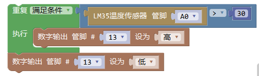

.. code-block:: c
	:linenos:

	void setup(){
  	  pinMode(13, OUTPUT);
	}
	void loop(){
  	  while (analogRead(A0)*0.488 > 30) {
        digitalWrite(13,HIGH);
  	}
  	digitalWrite(13,LOW);
	}

延时
---------------

描述
++++++++++++++

.. note::
	使程序暂定设定的时间（单位毫秒）。（一秒等于1000毫秒）。

参数
+++++++++++++++
* 毫秒：暂停的毫秒数。

范例
+++++++++

13号引脚灯亮1秒，灭1秒，往复循环。

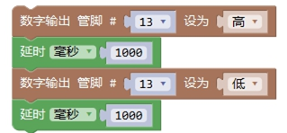

.. code-block:: c
	:linenos:

	void setup(){
	  pinMode(13, OUTPUT);
	}
	void loop(){
	  digitalWrite(13,HIGH);
	  delay(1000);
	  digitalWrite(13,LOW);
	  delay(1000);
	}

注释
+++++++++++++++
.. Attention::
	虽然创建一个使用delay()的闪烁LED很简单，并且许多例子将很短的delay用于消除开关抖动。

	但delay()确实拥有很多显著的缺点。在delay函数使用的过程中，读取传感器值、计算、引脚操作均无法执行，因此，它所带来的后果就是使其他大多数活动暂停。大多数熟练的程序员通常避免超过10毫秒的delay(),除非arduino程序非常简单。
	
	利用定时器，就可以解决这个问题，可以避免由于delay()带来的CPU暂停，也能很好地实现每隔一定时间执行动作。

如果(if)
---------------

描述
++++++++++++++

.. note::
	if 语句与比较运算符一起用于检测某个条件是否达成，如某个传感器的值是否等于某个值。

参数
+++++++++++++++
* 条件：比较表达式

用法
+++++++++++++++
增加条件：如果需要增加条件，可以点开齿轮，然后将左侧的“否则如果”或者“否则”模块拖到右侧的“如果”之中。

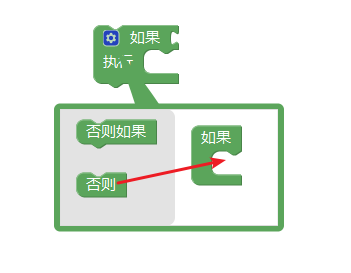

范例
+++++++++

当连接在2号引脚的按键按下时，点亮13号引脚的灯。

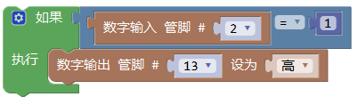

.. code-block:: c
	:linenos:

	void setup(){
	  pinMode(2, INPUT);
	  pinMode(13, OUTPUT);
	}
	void loop(){
	  if (digitalRead(2) == 1) {
	    digitalWrite(13,HIGH);
	  }
	}

如果判断的条件大于等于1时，可以省略等于判断，因为只要 该表达式的结果不为0，则为真。

所以，上面的写法与下面的写法等效。

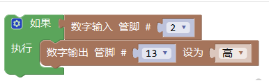

.. code-block:: c
	:linenos:

	void setup(){
	  pinMode(2, INPUT);
 	  pinMode(13, OUTPUT);
	}
	void loop(){
 	  if (digitalRead(2)) {
	    digitalWrite(13,HIGH);
  	}
	}

范例
+++++++++

当连接在2号引脚的按键按下时，点亮13号引脚的灯;当按键松开时，灯灭。

.. image:: images/03/if_example2.png

.. code-block:: c
	:linenos:

	void setup(){
	  pinMode(2, INPUT);
	  pinMode(13, OUTPUT);
	}
	void loop(){
	  if (digitalRead(2)) {
	    digitalWrite(13,HIGH);
  	} else {
	  digitalWrite(13,LOW);
  	}
	}

注释
+++++++++++++++
	另外一种进行多种条件分支判断的语句是switch case语句。

如果(switch)
---------------

描述
++++++++++++++

.. note::
	和if语句相同，switch…case通过设定的在不同条件下执行的代码控制程序的流程。

	特别地，switch语句将变量值和case语句中设定的值进行比较。当一个case语句中的设定值与变量值相同时，这条case语句将被执行。

	关键字break可用于退出switch语句，通常每条case语句都以break结尾。如果没有break语句，switch语句将会一直执行接下来的语句（一直向下）直到遇见一个break，或者直到switch语句结尾。

参数
+++++++++++++++
* var: 用于与下面的case中的标签进行比较的变量值

* label: 与变量进行比较的值

用法
+++++++++++++++
增加case：如果需要增加条件，可以点开齿轮，然后将左侧的“case”或者“default”模块拖到右侧的“switch”之中。

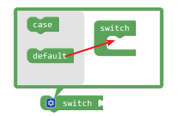

范例
+++++++++

当连接在2号引脚的按键按下时，点亮13号引脚的灯，否则13号引脚的灯灭

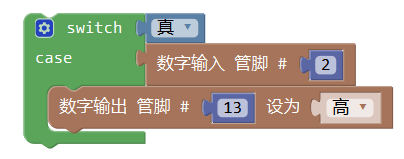

.. code-block:: c
	:linenos:

	void setup(){
	  pinMode(2, INPUT);
	  pinMode(13, OUTPUT);
	}
	void loop(){
	  switch (true) {
	    case digitalRead(2):
	    digitalWrite(13,HIGH);
	  break;
  	}
	}

注释
+++++++++++++++
	每个switch可以有多个case，但是最多不超过一个default，当不满足任何一个case时，执行default中的程序。

for循环
---------------

.. image:: images/03/for.png

描述
++++++++++++++

.. note::
	for循环用于重复执行一段的程序。通常使用一个增量计数器计数并终止循环。

	for循环用于重复性的操作非常有效，通常与数组结合起来使用来操作数据、引脚。

参数
+++++++++++++++
* 变量名：用于记录for循环次数的变量名。
* 起始值：循环的计数起始值，一般从0开头，也可以从其他数值开始。
* 终点值：循环的计数终点值。
* 步长：每次循环的步长，一般为1，也可以是其他整数。

用法
+++++++++++++++
可自行设置循环的变量名称，并确定循环的开始和终止以及循环方向，最后一个数字可以为负数。

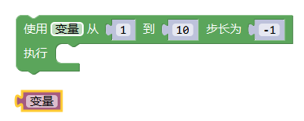

范例
+++++++++

将连接在3号引脚的灯制作成呼吸灯，每一次亮度变化之间间隔50毫秒

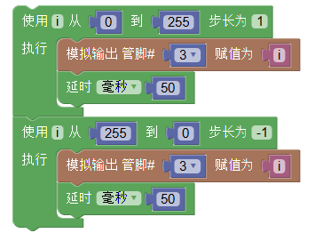

.. code-block:: c
	:linenos:

	void setup(){
	}
	void loop(){
	  for (int i = 0; i <= 255; i = i + (1)) {
	    analogWrite(3,i);
	    delay(50);
	}
	  for (int i = 255; i >= 0; i = i + (-1)) {
	    analogWrite(3,i);
	    delay(50);
	}
	}

注释
+++++++++++++++
	for循环中定义的变量有名字，可以用字母i,j,k或单词red,state等有意义的词语表示。

跳出循环
-------------

描述
++++++++++++++

.. note::
	跳出循环用于终止一段重复的程序，一般使用时作为条件语句的执行部分，当循环中的变量满足某个条件时，执行跳出循环语句。

	跳出循环在处理循环中的特殊情况时十分有用。

参数
+++++++++++++++
* 操作：可以选择跳出循环和跳到下一个循环两种操作，结果不同。

用法
+++++++++++++++
可直接加到循环语句当中，一般自行添加条件语句进行判断，判断为真时执行跳出循环语句。

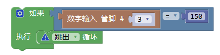

范例
+++++++++

引脚3上的数字从0到255逐一增加，每一次增加之间间隔50毫秒，当数字增加到150时停止增加

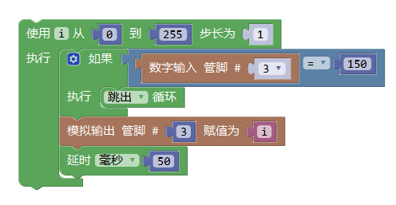

.. code-block:: c
	:linenos:

	void setup(){
	  pinMode(3, INPUT);
	  }
	void loop(){
	  for (int i = 0; i <= 255; i = i + (1)) {
	    if (digitalRead(3) == 150) {
	      break;
	}
	    analogWrite(3,i);
	    delay(50);
	}
	}

注释
+++++++++++++++
	注意跳到下一个循环的使用，可以方便的将循环中不需要的步骤跳过。

系统运行时间
---------------

描述
++++++++++++++

.. note::
	返回自硬件启动或重启以来的时间值。

返回
+++++++++++++++
自硬件启动或重启以来的时间，毫秒数或者微秒数。

用法
+++++++++++++++
返回系统运行时间，赋给某一变量，进行进一步的功能设计。

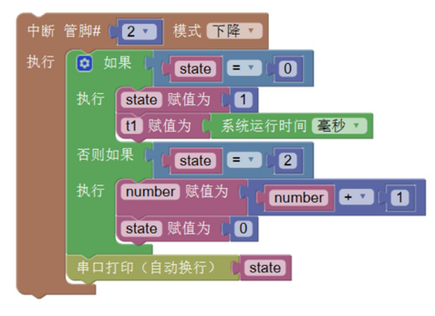

范例
+++++++++

自动换行打印系统运行时间

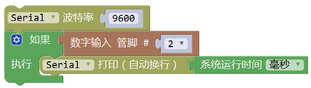

.. code-block:: c
	:linenos:

	void setup(){
	  Serial.begin(9600);
	  pinMode(2, INPUT);
	}
	void loop(){
	  if (digitalRead(2)) {
	    Serial.println(millis());
	  }
	}

MsTimer2 定时器
---------------

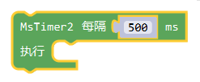

描述
++++++++++++++

.. note::
	每隔设置的毫秒数执行相应的程序

用法
+++++++++++++++
设置计时器的时间：计时器的时间可以进行修改。
主要用于设计定时改变状态的程序，可以通过计时器时间间隔设置进行状态会更改程序的运行。

范例
+++++++++
利用定时器控制13号引脚LED每隔1秒亮灭一次。

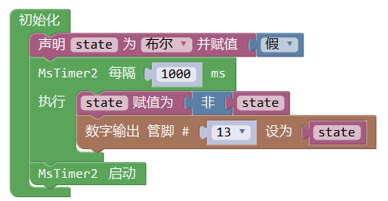

.. code-block:: c
	:linenos:

	#include <MsTimer2.h>
	volatile boolean state;
	void msTimer2_func() {
	  state = !state;
	  digitalWrite(13,state);
	}
	void setup(){
	  state = false;
	  pinMode(13, OUTPUT);
	  MsTimer2::set(1000, msTimer2_func);
	  MsTimer2::start();
	}
	void loop(){
	}

注释
+++++++++++++++
	利用定时器可以提高硬件的工作效率。

	但在一个程序中只能使用一个MsTimer2定时器，如果要实现多个时间的定时，可以配合变量计数来完成。

MsTimer2 定时器启动
----------------------

描述
++++++++++++++

.. note::
	MsTimer2定时器开始计时

用法
+++++++++++++++
需要使用MsTimer2计时器时，需要先插入MsTimer2定时器启动模块，开始计时，需要与MsTimer2定时器配合使用。

MsTimer2 定时器停止
-----------------------

描述
++++++++++++++

.. note::
	MsTimer2定时器停止计时

用法
+++++++++++++++
需要使用MsTimer2计时器时，需要先插入MsTimer2定时器启动模块，开始计时，需要与MsTimer2定时器配合使用，插入停止模块后计时器停止计时。

允许中断
-------------------

描述
++++++++++++++

.. note::
	允许输入/输出模块中管脚中断的运行

用法
+++++++++++++++
主要用于加入禁止中断模块后恢复中断执行。

范例
+++++++++
使用按钮模拟开关，每次按下，LED灯切换亮灭

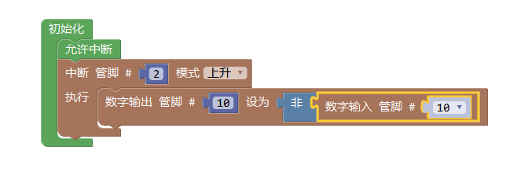

.. code-block:: c
	:linenos:

	void attachInterrupt_fun_2() {
	  digitalWrite(10,(!digitalRead(10)));
	}
	void setup(){
	  pinMode(2, INPUT);
	  pinMode(10, OUTPUT);
	  interrupts();
	  attachInterrupt(digitalPinToInterrupt(2),attachInterrupt_fun_2,RISING);
	}
	void loop(){
	}

禁止中断
-------------------

描述
++++++++++++++

.. note::
	禁止输入/输出模块中管脚中断的运行

用法
+++++++++++++++
主要用于禁止中断模块的中断执行。

范例
+++++++++
在允许中断范例的基础上，尝试禁止中断

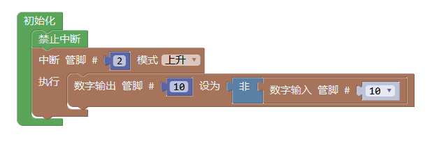

.. code-block:: c
	:linenos:

	void attachInterrupt_fun_2() {
	  digitalWrite(10,(!digitalRead(10)));
	}
	void setup(){
	  pinMode(2, INPUT);
	  pinMode(10, OUTPUT);
	  noInterrupts();
	  attachInterrupt(digitalPinToInterrupt(2),attachInterrupt_fun_2,RISING);
	}
	void loop(){
	}

SCoop Task
-------------------

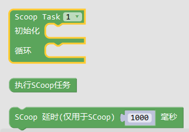

描述
++++++++++++++
SCoop模块用于执行多线程任务，最多支持8个任务。

用法
+++++++++++++++
在sCoop task中编写每个线程需要执行的任务。

范例
+++++++++
利用SCoop，控制13号引脚LED灯以2秒的频率闪烁，同时控制12号引脚的LED灯以200毫秒的频率闪烁。

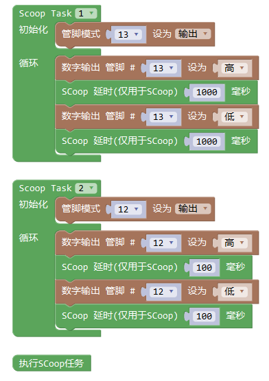

.. code-block:: c
	:linenos:

	#include "SCoop.h"
	defineTask(scoopTask1)
	void scoopTask1::setup()
	{
	  pinMode(13, OUTPUT);
	}
	void scoopTask1::loop()
	{
	  digitalWrite(13,HIGH);
	  sleep(1000);
	  digitalWrite(13,LOW);
	  sleep(1000);
	}
	defineTask(scoopTask2)
	void scoopTask2::setup()
	{
	  pinMode(12, OUTPUT);
	}
	void scoopTask2::loop()
	{
	  digitalWrite(12,HIGH);
	  sleep(100);
	  digitalWrite(12,LOW);
	  sleep(100);
	}
	void setup(){
	  pinMode(13, OUTPUT);
	  mySCoop.start();
	  pinMode(12, OUTPUT);
	}
	void loop(){
	  yield();
	}