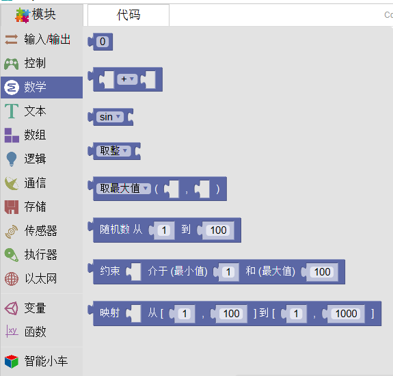

数学
====================
该部分主要完成数学变换功能，具体包括数字映射、数字约束、数学运算、取整、随机、三角函数。

随机数
-----------------
.. image:: images/04/math2.png

随机数是一个左闭右开的取值范围。也就是较小的数可以取到，较大的数无法取到。
约束
------------
.. image:: images/04/math3.png

约束是将数值限制在最小值与最大值之间，所有小于最小值的数值被赋值为最小值，同理，所有大于最大值的数被赋值为最大值。
映射
------------------

.. image:: images/04/math5.png
上图为LED与蜂鸣器同步增大或减小的代码。因为对于sin(i)来说，其值域为正数时i的取值范围为[0,180]，不过对于LED的呼吸灯来说，最大值可以取到255，因此在这里运用一个映射，即使i因循环本身最大只能取到179，但通过一一映射，i的实际值可以取到[0,255]。