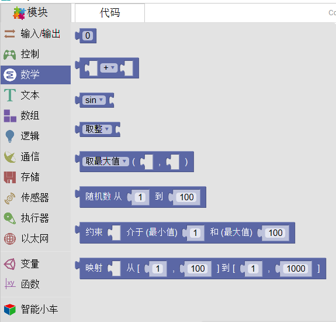
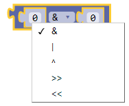

数学
=========

该部分主要完成数学变换功能，具体包括数字映射、数字约束、数学运算、取整、随机、三角函数。

数字常量
---------

描述
************

数字常量包括 整数常量和浮点常量。

.. note::
	整数常量是直接在程序中使用的数字，如123。默认情况下，这些数字被视为int类型。通常情况下，整数常量默认为十进制，但可以加上特殊前缀表示为其他进制。如：B0111，表示二进制；0173,表示八进制；0x7B，表示十六进制。

	浮点常量也可以直接中程序中使用，如12.3。默认情况下，这些数字被视为float类型。也可以使用科学计数法表示浮点数。如：2.34E5代表2.34 * 10^5，其实际值为234000；67E-12代表67.0 * 10^-12，其实际值为0.000000000067。

数学运算
-----------

描述
*****

.. note::
	数学运算中包括加、减、乘、除、取模、幂运算。
	这些运算将会返回两个操作数的和,差,乘积,商，取模、幂。

.. Attention::
	- 这些运算是根据操作数的数据类型来计算的,比如 9和4都是int类型,所以9/4结果是2。

	- 如果想要两个整数相除得到小数，就需要将整数转换成小数。如9.0/2.0=4.5 。

	- 这也就代表如果运算结果比数据类型所能容纳的范围要大的话，就会出现溢出。例如. 1加上一个整数 int类型 32,767 结果变成-32,768。

	- 如果操作数是不同类型的,结果是“更大”的那种数据类型。如果操作数中的其中一个是 float类型或者double类型, 就变成了浮点数运算。

参数
********

常量或变量

返回值
*************

两个操作数的和,差,乘积,商，取模、幂。

位运算
-----------

描述
********

.. note::
	按位操作符对变量进行位级别的计算。

按位与(&)
**********

按位与操作符一个&符，用在两个整型变量之间。按位与运算符对两侧的变量的每一位都进行运算。

规则是：如果两个运算元都是1，则结果为1，否则输出0。

如： 0011&0101=0001

在Arduino中，int类型为16位，所以在两个int表达式之间使用&会进行16个并行按位与计算。代码片段就像这样：

int a =  92;    //二进制:  0000000001011100

int b = 101;    //二进制:  0000000001100101

int c = a & b;  //结果:    0000000001000100

a和b的16位每位都进行按位与计算，计算结果存在c中，二进制结果是01000100，十进制结果是68.

按位或(|)
*************

按位或操作符是|。和&操作符类似，|操作符对两个变量的为一位都进行运算，只是运算规则不同。

按位或规则：只要两个位有一个为1则结果为1，否则为0。

如：0011|0101=0111

int a =  92;    // 二进制: 0000000001011100

int b = 101;    //二进制: 0000000001100101

int c = a | b;  // 结果:  0000000001111101, 或十进制的125

按位异或(^)
*************

按位异或是一个不常见的操作符，也叫做XOR（通常读作”eks-or“）。

按位异或操作符用 ^ 表示。按位异或是如果两个位值相同则结果为0，否则为1。

如：0011^0101=0110

左移位运算(<<)
********************

左移位运算可使左运算元中的某些位移动右运算元中指定的位数。

如：
int a = 5;        // 二进制数: 0000000000000101

int b = a << 3;   // 二进制数: 0000000000101000, 或十进制数：40

//当你将x左移y位时（x«y），x中最左边的y位会逐个逐个的丢失：

int a = 5;        // 二进制: 0000000000000101

int b = a << 14;  // 二进制: 0100000000000000 - 101中最左边的1被丢弃

如果你确定位移不会引起数据溢出，你可以简单的把左移运算当做对左运算元进行2的右运算元次方的操作。

右移位运算(>>)
**********************

右移位运算与左移位运算类似。

三角函数及其他
-----------------

sin
*************

.. note::
	计算角度的正弦（弧度）。其结果在-1和1之间。

- 参数: 弧度制的角度（float）

- 返回值:角度的正弦值（double）

cos
*************

.. note::
	计算一个角度的余弦值（用弧度表示）。返回值在 -1 和 1 之间。

- 参数: 弧度制的角度（float）

- 返回值:角度的正弦值（double）

tan
*********

.. note::
	计算角度的正切（弧度）。结果在负无穷大和无穷大之间。

- 参数: 弧度制的角度（float）

- 返回值:角度的正切值

asin
*************

.. note::
	反正弦函数为正弦函数sin的反函数。

- 参数: [-1,1]

- 返回值:[-π/2,π/2]

acos
*************

.. note::
	反余弦函数为余弦函数cos的反函数。

- 参数: [-1,1]

- 返回值:[0,π]

atan
*************

.. note::
	反正切函数为正切函数tan的反函数。

- 参数: [-∞,∞]

- 返回值:(-π/2,π/2)

数学运算2
--------------

取整（四舍五入）
*****************

.. note::
	返回给定值的四舍五入取整值。如round(4.1)=4;round(5.6)=6。

- 参数: 数值或变量。

- 返回值:给定值的四舍五入取整值

取整（取上限）
***************

.. note::
	返回给定值的下一个整数，如果输入的本身就是整数，则返回自身。如ceil(4.1)=5;ceil(5.6)=6,ceil(7)=7。

- 参数: 数值或变量。

- 返回值:给定值的下一个整数或自身。

取整（取上限）
***************

.. note::
	返回给定值的前一个整数，如果输入的本身就是整数，则返回自身。如ceil(4.1)=4;ceil(5.6)=5,ceil(7)=7。

- 参数: 数值或变量。

- 返回值:给定值的前一个整数或自身。

取绝对值
***************

.. note::
	返回给定值的绝对值。如abs(4.1)=4;abs(-5.6)=5,abs(7)=7。

- 参数: 数值或变量。

- 返回值:给定值的绝对值。

平方
***************

.. note::
	返回给定值的平方。如 sq(4)=16;sq(-5)=25,sq(7)=49。

- 参数: 数值或变量。

- 返回值:给定值的平方。

平方根
***************

.. note::
	返回给定值的正平方根。如 sqrt(4)=2;sqrt(25)=5。

- 参数: 数值或变量。

- 返回值:给定值的正平方根。

取最大(小)值
--------------

.. note::
	返回两个数值或变量中最大或最小值。

- 参数:数值或者变量

- 返回值:最大值或最小值

初始化随机数
------------------

随机数
-----------

随机数是一个左闭右开的取值范围。也就是较小的数可以取到，较大的数无法取到。

约束
-----

约束是将数值限制在最小值与最大值之间，所有小于最小值的数值被赋值为最小值，同理，所有大于最大值的数被赋值为最大值。

映射
------------

上图为LED与蜂鸣器同步增大或减小的代码。因为对于sin(i)来说，其值域为正数时i的取值范围为[0,180]，不过对于LED的呼吸灯来说，最大值可以取到255，因此在这里运用一个映射，即使i因循环本身最大只能取到179，但通过一一映射，i的实际值可以取到[0,255]。
