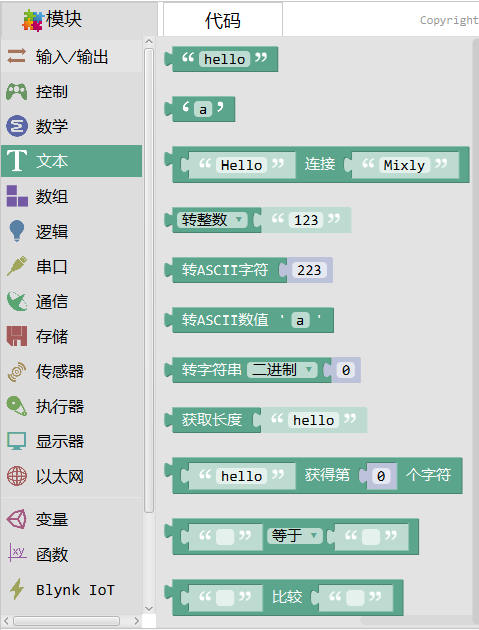

文本
===============
文本的具体内容为代码的文本输出功能，具体包括：文本连接、文本转数字、数字转文本。

所有文本内容可通过串口监视器或外接显示屏打印。

字符串
------------

.. note::
	字符串常量。

字符
-------------

.. note::
	字符常量。

字符串连接
-------------

.. note::
	字符串连接，可以将两个或者多个字符串连接成一个。
范例
+++++++++

连接多个字符串。

字符串转数字(toInt()/toFloat())
--------------------------------

.. note::
	将字符串中的数字转成整数或者小数。

转ASCII字符(char())
--------------------

.. image:: images/05/numtochar.png

.. note::
	将数字转成ASCII字符。

转ASCII数值(toascii)
-----------------------

.. image:: images/05/toascii.png

.. note::
	将字符转成ASCII码。

进制 转字符串
--------------------

.. note::
	将一个数字转化为字符串，支持二进制、八进制、十进制、十六进制数字。

获取字符串长度(String().length())
-----------------------------------

获取字符串第N个字符
-------------------

字符串比较1
---------------

字符串比较2
---------------

