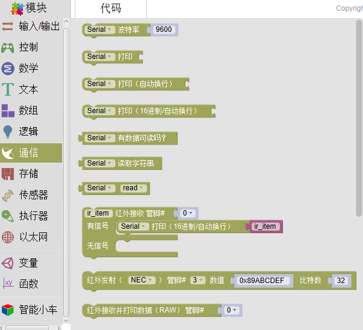
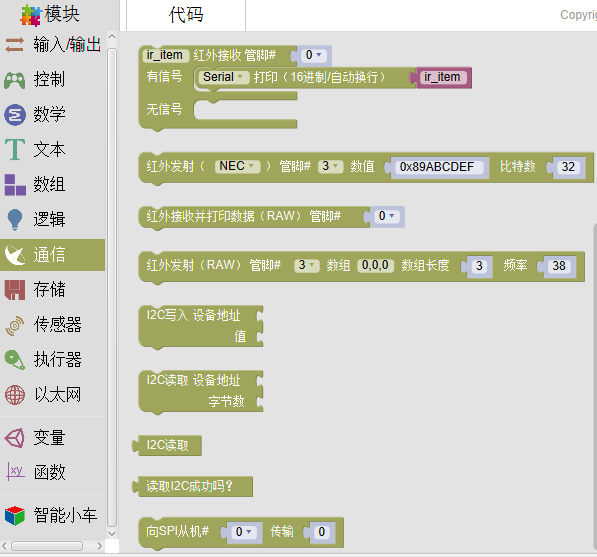
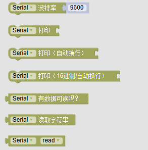
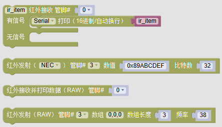

通信
====================

通信是为了方便人与计算机交互而采用的一种特殊通信方式。具体包括：串口通信(新增串口选择和波特率设置)、红外通信、I2C通信、SPI通信（新增）。

串口通信
------------------

串口通信功能学生可在串口监视器中查看。这一功能对于学生检查自己代码以及监视传感器数据提供了便利条件。
假设学生将LM35的温度传感器接到模拟管脚A0口，学生可通过

指令观察当前室温。随后可能会提出疑问：当前室温怎么可能是58？这将引发学生进一步的思考造成该数据的可能性。

红外通信
-----------

上图指令主要运用的是红外接收管与遥控器之间的数据发射与接收功能。学生掌握了红外通信的相关内容，便可以制作遥控风扇、遥控汽车等自主设计更强的创意电子产品。

I2C通信
------------

I2C（Inter－Integrated Circuit）是同步通信的一种特殊形式，具有接口线少，控制方式简单，器件封装形式小，通信速率较高等优点。Mixly支持I2C的读取和写入，并且支持基于I2C协议的执行器。

SPI通信
--------------
SPI是串行外设接口（Serial Peripheral Interface）的缩写。SPI，是一种高速的，全双工，同步的通信总线，并且在芯片的管脚上只占用四根线，节约了芯片的管脚，同时为PCB的布局上节省空间，提供方便，拥有简单易用的特性。用户可以使用Mixly向SPI传输数据。