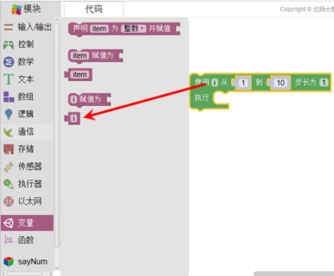

变量
==============
依据变量类型可分为：浮点变量、整型变量、布尔变量、字符串变量。根据变量的值又可分为高或低、真或假。

.. image:: images/13/variable1.png

在运算中，变量是一个使用非常频繁的指令。比如在2.1.7.2使用红外接收管和遥控器的相关代码中，ir_item就是一个变量。
在使用变量时，如果用户在程序建构区内已新建了一个变量（例如使用循环语句i变量），变量模块将自动生成了一个相对应的系统变量i，用户直接使用即可。

