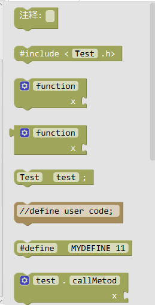
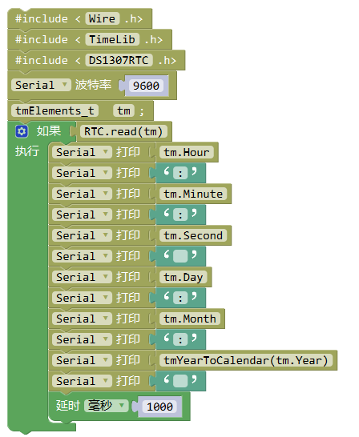

Factory
===================
Factory中的模块可以方便用户编写Mixly中不支持的传感器功能。

将以RTC1307库为例，介绍利用factory中的模块，在Mixly快速使用Arduino标准库。

准备工作
----------
1.从github.com等网站下载ds1307RTC Arduino库。
2.将库文件解压到Mixly/\arduino-1.x.x/\portable/\sketchbook/\libraries目录中。
3.打开Mixly自带的arduino IDE（路径\Mixly\arduino-1.x.x\arduino.exe），在软件中打开 库目录下的example范例，编译并上传，测试能否正常使用。如果不能正常使用，则需要更换库或者检查硬件问题。

重写程序
-----------

打开范例程序Mixly/\arduino-1.x.x/\portable/\sketchbook/\libraries/\DS1307RTC/\examples/\ReadTime/\ReadTest/\ReadTest.ino，先分析程序，并适当简化程序。

源程序如下：

.. code-block:: c
    :linenos:
  
	#include <Wire.h>
	#include "TimeLib.h"
	#include "DS1307RTC.h"

	void setup() {
	  Serial.begin(9600);
	  while (!Serial) ; // wait for serial
	  delay(200);
	  Serial.println("DS1307RTC Read Test");
	  Serial.println("-------------------");
	}

	void loop() {
	  tmElements_t tm;

	  if (RTC.read(tm)) {
	    Serial.print("Ok, Time = ");
	    print2digits(tm.Hour);
	    Serial.write(':');
	    print2digits(tm.Minute);
	    Serial.write(':');
	    print2digits(tm.Second);
	    Serial.print(", Date (D/M/Y) = ");
	    Serial.print(tm.Day);
	    Serial.write('/');
	    Serial.print(tm.Month);
	    Serial.write('/');
	    Serial.print(tmYearToCalendar(tm.Year));
	    Serial.println();
	  } else {
	    if (RTC.chipPresent()) {
	      Serial.println("The DS1307 is stopped.  Please run the SetTime");
	      Serial.println("example to initialize the time and begin running.");
	      Serial.println();
	    } else {
	      Serial.println("DS1307 read error!  Please check the circuitry.");
	      Serial.println();
	    }
	    delay(9000);
	  }
	  delay(1000);
	}

	void print2digits(int number) {
	  if (number >= 0 && number < 10) {
	    Serial.write('0');
	  }
	  Serial.print(number);
	}

简化程序如下：

.. code-block:: c
    :linenos:
  
	#include <Wire.h>
	#include "TimeLib.h"
	#include "DS1307RTC.h"

	void setup() {
	  Serial.begin(9600);
	}

	void loop() {
	  tmElements_t tm;
	  if (RTC.read(tm)) {
	    Serial.print(tm.Hour);
	    Serial.print(':');
	    Serial.print(tm.Minute);
	    Serial.print(':');
	    Serial.print(tm.Second);
	    Serial.print(tm.Day);
	    Serial.print('/');
	    Serial.print(tm.Month);
	    Serial.print('/');
	    Serial.print(tmYearToCalendar(tm.Year));
	  }
	  delay(1000);
	}

Factory模式下模块：

编写完成后，编译并上传，进行测试。测试利用factroy编写的程序效果是否与arduino IDE编写相同。
