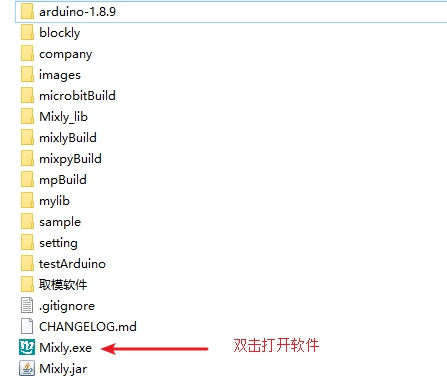
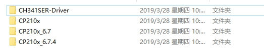
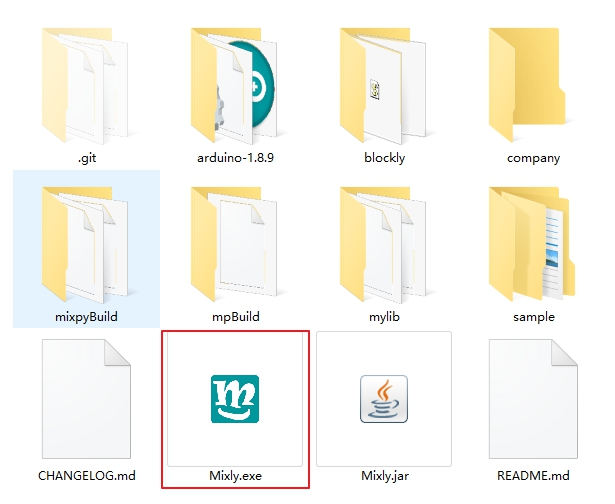

安装Mixly软件
========
下载Mixly软件
------------
* `下载地址1 <https://pan.baidu.com/s/1dE3Z6db#list/path=%2F>`_
* 下载地址2：Mixly官方QQ群文件，1号群：434982462；2号群：199124078

解压缩
---------------

下载后Mixly压缩包，右键解压到Mixly目录下

物理连接
---------------

通过USB线把开发板和电脑相连。

驱动安装
--------------

* 驱动程序在arduino-1.x.x/\drivers目录中。

* 根据您使用的开发板的串口芯片选择相应的驱动。

启动Mixly
---------------

双击Mixly目录下的Mixly.exe即可启动。

