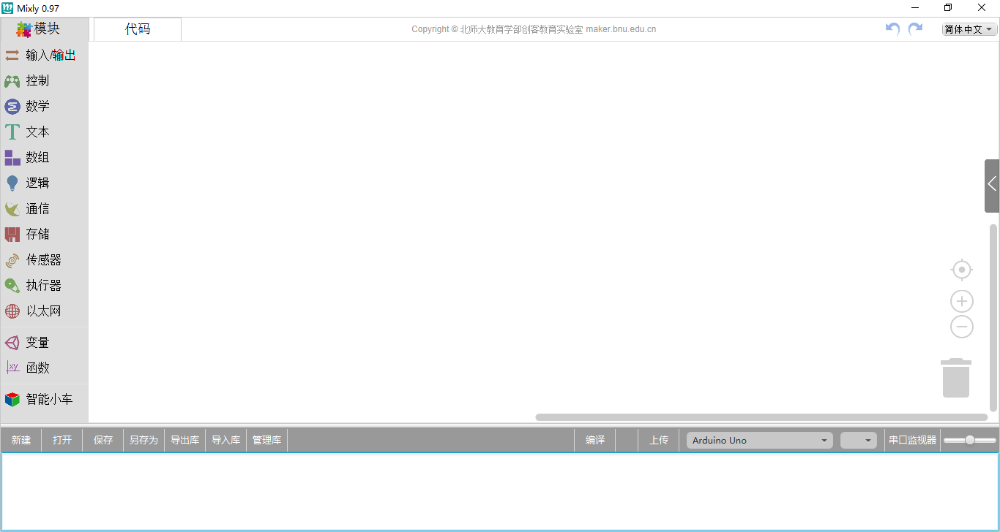
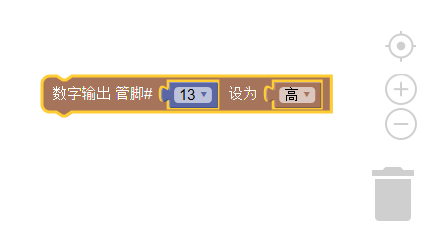
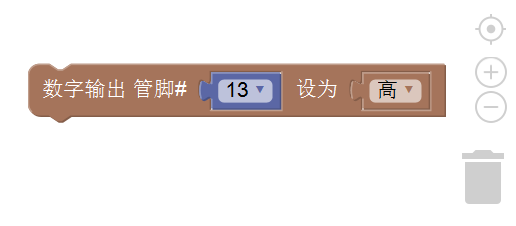
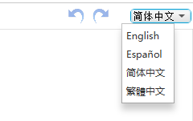

程序编写区
============
程序编写
-------------

我们通常把能完成一定功能的代码拖动到该区域处进行连接。

程序删除
----------------
* 将不需要的代码拖到右下方的垃圾桶
* 将不用的代码拖到最左侧（模块选择区）
* 选中不用的代码后点击键盘Delete

程序缩放
--------------
在右下角垃圾桶上方有缩放按钮，按下＋，可以放大代码；按下-，可以缩小代码。

在该图形上还有一个图形，它的功能是将代码大小正常化并居中。点击它后编写的代码大小正常化并出现在搭建区最中心的位置。

切换语言
--------------
在该区域的右上角，还可以选取语言的种类。

截止目前为止，Mixly可支持英语、西班牙语、简体中文及繁体中文。

撤销及重做
--------------
在选择语言的左边还有两个箭头，分别是撤销（undo，Ctrl + Z）及重做（redo，Ctrl + Y）。

撤销功能是当我们编写代码时误删代码后，便可点击左箭头或直接按Ctrl + Z来恢复误删代码。

而重做则是和Ctrl + Z相反，它是恢复上一步操作，该功能也可通过点击右箭头或直接键入Ctrl + Y 来实现。

